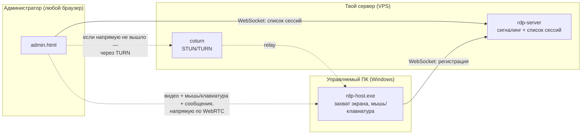

# RDP-Tool

Простой удалённый доступ вроде AnyDesk, но сильно проще: один сервер, один
агент на управляемом ПК (Windows) и админка — просто страница в браузере,
без установки чего-либо на компьютер администратора.

- Экран управляемого ПК передаётся в браузер в реальном времени
- Управление мышью и клавиатурой — включается отдельным тумблером (по
  умолчанию выключено) и хоткеем, который можно перебиндить
- Можно отправить текст, который на секунду всплывёт у курсора на
  управляемом ПК и сам исчезнет — без рамок, поверх всех окон

## Как это работает



Сервер сам по себе видео и управление не передаёт — он только "знакомит"
браузер и `rdp-host.exe` друг с другом (WebRTC-сигналинг), дальше трафик
идёт напрямую между ними (или через TURN-relay, если напрямую через
NAT/файрвол не получается).

## Скриншоты

Список сессий:


Окно управления — видео, тумблеры мыши/клавиатуры с хоткеями, форма
сообщения:


Тумблеры включены, сообщение готово к отправке:


## Быстрый старт

Нужно три вещи: сервер (свой VPS с публичным IP), `rdp-host.exe` на
управляемом ПК, и браузер у администратора.

### 1. Собрать бинарники

Собирается на любой ОС (кросс-компиляция, без Docker и прочего):

```bash
make server   # bin/rdp-server   — для Linux (VPS)
make host     # bin/rdp-host.exe — для Windows (управляемый ПК)
```

### 2. Запустить сервер на VPS

Для быстрой проверки (без TLS, только в своей сети):

```bash
scp bin/rdp-server you@vps:/opt/rdp-tool/
ssh you@vps '/opt/rdp-tool/rdp-server -addr :9000'
```

Для реальной работы через интернет (systemd-сервис, TLS, TURN-сервер для
обхода NAT) — подробная пошаговая инструкция в
[`docs/deploy/vps-setup.md`](docs/deploy/vps-setup.md).

### 3. Запустить агента на управляемом ПК

Скопируй `rdp-host.exe` на Windows-компьютер и запусти:

```
rdp-host.exe -name "MY-PC" -server ws://ВАШ-СЕРВЕР:9000/ws/host
```

(Для доступа через интернет вместо `ws://` используй `wss://` и добавь
`-ice-servers`/`-turn-username`/`-turn-credential` — см. деплой-гайд.)

### 4. Открыть админку

Просто зайди в браузере на `http://ВАШ-СЕРВЕР:9000/` (или `https://...`
после настройки TLS) — увидишь список подключённых ПК, кликаешь и
управляешь.

## Возможности

| Что | Как |
|---|---|
| Просмотр экрана | автоматически при подключении к сессии |
| Управление мышью | тумблер "Mouse" (по умолчанию выкл) или хоткей `Ctrl+Alt+M` |
| Управление клавиатурой | тумблер "Keyboard" (по умолчанию выкл) или хоткей `Ctrl+Alt+K` |
| Перебиндинг хоткея | кнопка "Rebind" → нажать новую комбинацию |
| Всплывающее сообщение | поле текста + время затухания (по умолчанию 2.0 сек, шаг 0.1) |

## Структура проекта

```
cmd/server/     — сигнальный сервер + отдаёт страницу админки (Linux/любая ОС)
cmd/host/       — агент на управляемом ПК (только Windows)
cmd/captest/    — диагностика: проверить захват экрана на реальной Windows
cmd/inputtest/  — диагностика: проверить эмуляцию мыши/клавиатуры
cmd/overlaytest/— диагностика: проверить всплывающее сообщение
internal/webui/ — сама админка: один HTML-файл (admin.html) + встраивание
internal/hostapp/, internal/capture/, internal/input/, internal/overlay/
                — Windows-специфичная логика агента (захват, ввод, оверлей)
internal/proto/, internal/signaling/, internal/webrtcconn/, internal/hotkey/
                — общий протокол и сетевая логика, с тестами
docs/deploy/    — гайд по деплою на VPS (systemd, coturn, TLS)
docs/plans/     — подробный план разработки (для истории/справки)
```

### Диагностика на Windows

Если что-то не работает именно на управляемом ПК, есть три отдельных
утилиты — гоняют одну конкретную вещь без запуска всего проекта:

```
captest.exe     — делает один снимок экрана → capture_test.jpg
inputtest.exe   — двигает мышь и печатает "a" через пару секунд
overlaytest.exe — показывает тестовое всплывающее сообщение у курсора
```

Собираются так же: `go build -o captest.exe ./cmd/captest` (аналогично
для остальных двух), кросс-компиляция под Windows с любой ОС:
`GOOS=windows GOARCH=amd64 go build ...`.

## Известные ограничения (MVP)

- Только Windows на стороне управляемого ПК
- Раскладка клавиатуры при пробросе клавиш — американская (US)
- Одна активная админ-сессия на хост одновременно
- Нет звука, нет буфера обмена, нет мульти-монитора
- Видео — JPEG-кадры (~10 fps), не полноценный видеокодек: экономит время
  разработки, но не так плавно, как настоящий AnyDesk
