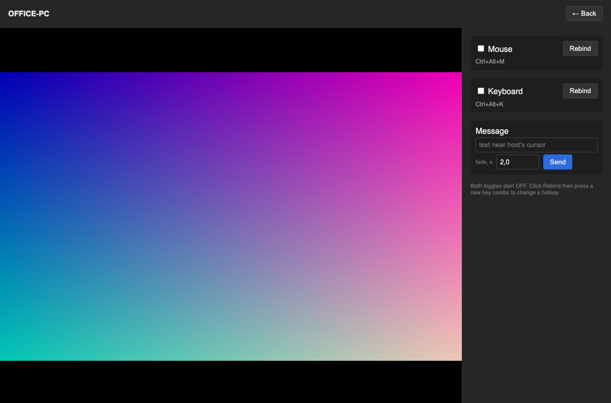
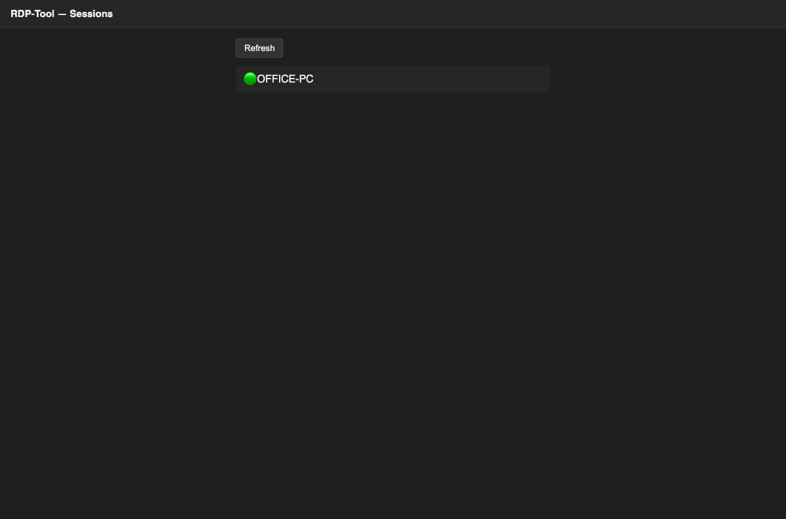
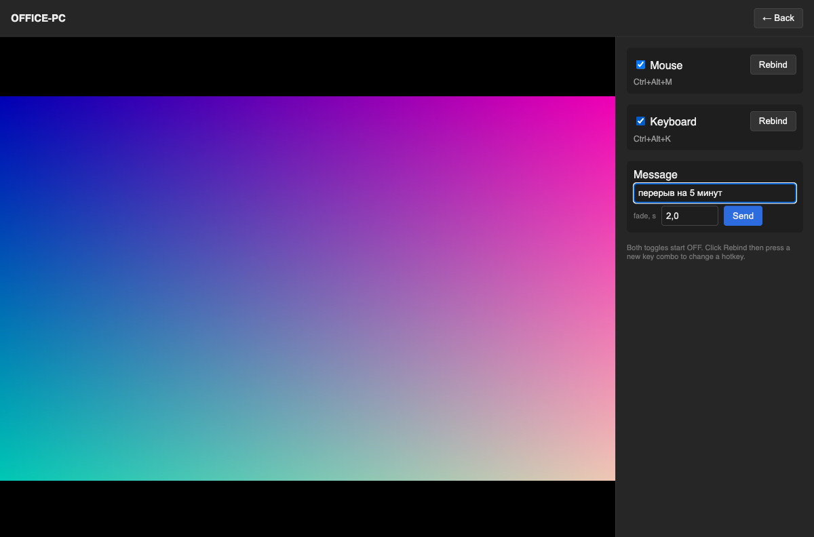

# RDP-Tool

Свой простой удалённый доступ (как AnyDesk, но проще): сервер на твоём
VPS, программа-агент на управляемом Windows-ПК, админка — просто
страница в браузере, без установки чего-либо.



## Кто что делает

Три роли, три разные вещи:

1. **Ты (один раз)** — поднимаешь сервер на своём VPS и собираешь
   `rdp-host.exe` с уже зашитым адресом этого сервера.
2. **Второй ПК (Windows, которым будешь управлять)** — просто копируешь
   туда готовый `rdp-host.exe` и запускаешь. Никаких флагов вводить не
   нужно — адрес сервера уже "зашит" внутри файла.
3. **Ты как админ (каждый раз, когда хочешь подключиться)** — открываешь
   в браузере адрес своего сервера, видишь список ПК, кликаешь.

## Шаг 1. Поднять сервер на VPS

На своей машине собери сервер под Linux:

```bash
make server
```

Скопируй `bin/rdp-server` на VPS и запусти:

```bash
scp bin/rdp-server you@your-vps-ip:/opt/rdp-tool/
ssh you@your-vps-ip
/opt/rdp-tool/rdp-server -addr :9000
```

Это самый быстрый способ проверить, что всё работает. Для постоянной
работы (чтобы сервер не падал при перезагрузке VPS, работал через
`https://`, и чтобы соединение проходило через интернет, а не только в
одной сети) — держись гайда [`docs/deploy/vps-setup.md`](docs/deploy/vps-setup.md),
там пошагово: systemd-сервис, TLS, TURN-сервер для обхода NAT.

## Шаг 2. Собрать rdp-host.exe с зашитым адресом сервера

На своей машине (адрес сервера — тот же, что в шаге 1):

```bash
make host SERVER=ws://your-vps-ip:9000/ws/host
```

Получится `bin/rdp-host.exe`. Копируешь этот файл на компьютер, которым
хочешь управлять, и просто запускаешь двойным кликом (или из
командной строки, если хочешь видеть логи) — он сам подключится к
твоему серверу. Никаких параметров вводить не нужно, они уже внутри
файла.

Если позже захочешь пересобрать под другой сервер — команда та же с
другим `SERVER=...`. Полный список того, что можно зашить (TURN-сервер
и т.п.) — в конце этого файла.

## Шаг 3. Открыть админку

Заходишь в браузере на `http://your-vps-ip:9000/` (или на свой домен,
если настроил TLS по гайду) — видишь список подключённых ПК:



Кликаешь на нужный — открывается окно с экраном этого ПК:



| Что | Как |
|---|---|
| Просмотр экрана | появляется сам, сразу после клика по сессии |
| Управление мышью | тумблер "Mouse" (по умолчанию выключен) или хоткей `Ctrl+Alt+M` |
| Управление клавиатурой | тумблер "Keyboard" (по умолчанию выключен) или хоткей `Ctrl+Alt+K` |
| Сменить хоткей | кнопка "Rebind" → нажать новую комбинацию клавиш |
| Всплывающее сообщение у курсора | поле текста внизу + время затухания (по умолчанию 2.0 сек) → "Send" |

## Проверить всё на одном компьютере (без второго ПК и VPS)

Если хочешь сначала просто посмотреть, как это выглядит, не разворачивая
ничего на VPS:

```bash
make server
./bin/rdp-server -addr :9000        # сервер локально
```

А `rdp-host.exe` можно собрать под Windows и погонять в виртуалке, либо
просто убедиться, что сервер запустился и открыть `http://localhost:9000/`
в браузере (список сессий будет пустой, пока не подключишь хост).

## Как это устроено (если интересно)

```mermaid
flowchart LR
    subgraph Admin["Ты в браузере"]
        A[admin.html]
    end
    subgraph VPS["Твой сервер"]
        S[rdp-server]
        T[coturn — обход NAT]
    end
    subgraph PC["Второй ПК"]
        H[rdp-host.exe]
    end

    A -- "список сессий" --> S
    H -- "регистрация" --> S
    A -. "видео, мышь, клавиатура, сообщения — напрямую" .-> H
    A -. "если напрямую не получилось" .-> T
    T -. "" .-> H
```

Сервер не передаёт через себя видео и управление — он только знакомит
браузер и `rdp-host.exe`. Дальше всё идёт напрямую между ними (WebRTC),
а `coturn` нужен только как запасной путь, если напрямую через
NAT/файрвол не получается.

## Что можно зашить в бинарник при сборке

Через `make host`/`make server` с переменными — не передано, значит
берётся дефолт (обычно `localhost`):

```bash
make host SERVER=wss://mydomain.com/ws/host \
          ICE_SERVERS=stun:mydomain.com:3478,turn:mydomain.com:3478 \
          TURN_USERNAME=rdp \
          TURN_CREDENTIAL=секрет

make server ADDR=:9000 \
            ICE_SERVERS=stun:mydomain.com:3478,turn:mydomain.com:3478 \
            TURN_USERNAME=rdp \
            TURN_CREDENTIAL=секрет
```

Если что-то из этого не зашито — можно передать флагом при запуске
(`rdp-host.exe -server ...`), он переопределит зашитое значение.

## Известные ограничения (это MVP)

- Только Windows на стороне управляемого ПК
- Раскладка клавиатуры при пробросе клавиш — американская (US)
- Одна активная админ-сессия на хост одновременно
- Нет звука, нет буфера обмена, нет мульти-монитора
- Видео — JPEG-кадры (~10 fps), не полноценный видеокодек: попроще в
  реализации, но не так плавно, как в настоящем AnyDesk

## Структура проекта / диагностика

```
cmd/server/     — сигнальный сервер + отдаёт страницу админки
cmd/host/       — агент на управляемом ПК (только Windows)
cmd/captest/    — диагностика: проверить захват экрана на реальной Windows
cmd/inputtest/  — диагностика: проверить эмуляцию мыши/клавиатуры
cmd/overlaytest/— диагностика: проверить всплывающее сообщение
internal/webui/ — сама админка: один HTML-файл (admin.html)
internal/       — остальная логика (протокол, сеть, захват, ввод — с тестами)
docs/deploy/    — подробный гайд по деплою на VPS
```

Диагностические утилиты собираются так же, как host: `go build -o captest.exe ./cmd/captest`
(и аналогично `inputtest`, `overlaytest`) — гоняют одну конкретную вещь
(снимок экрана / мышь+клавиатура / оверлей), если что-то не работает
именно на управляемом ПК и непонятно, что именно.
